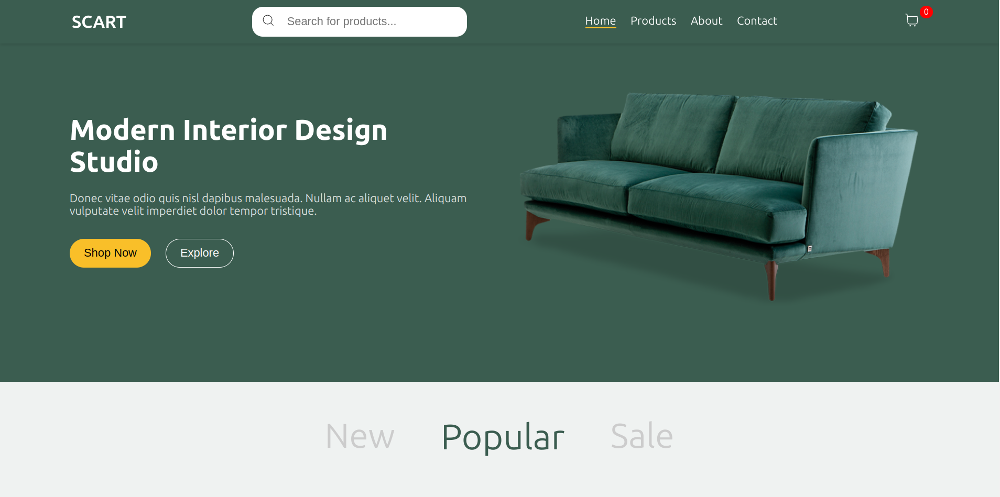

# SCART - Your E-Commerce Solution

SCART is a modern, responsive e-commerce platform built with React.



## Table of Contents

- [Features](#features)
- [Getting Started](#getting-started)
- [API](#api)
- [To-Do](#to-do)

## Features

- Responsive design for mobile and desktop
- Product catalog with search functionality
- Shopping cart with real-time updates
- Checkout process
- User authentication (coming soon)

## Getting Started

### Prerequisites

- Node.js (v14.0.0 or later)
- npm (v6.0.0 or later)

### Installation

1. Clone the repository:
   ```
   git clone https://github.com/Sachita007/SCART.git
   ```
2. Navigate to the project directory:
   ```
   cd SCART
   ```
3. Install dependencies:
   ```
   npm install
   ```
4. Start the development server:
   ```
   npm start
   ```
5. Open [http://localhost:3000](http://localhost:3000) to view it in the browser.

## API

SCART uses the my Own FakeShopAPI for managing product data. The FakeShopAPI is a RESTful API built with Node.js, Express.js, and MongoDB.

- [Repo Link](https://github.com/Sachita007/FakeShopAPI)

FakeShopAPI Documentation
For detailed information on how to use the FakeShopAPI, please refer to the [API Documentation](https://fake-shopapi.netlify.app/).

## To-Do

- Implement user authentication
- Add product reviews and ratings
- Create an admin dashboard for managing products
- Integrate with a payment gateway
- Implement order tracking functionality
- Add a wishlist feature
